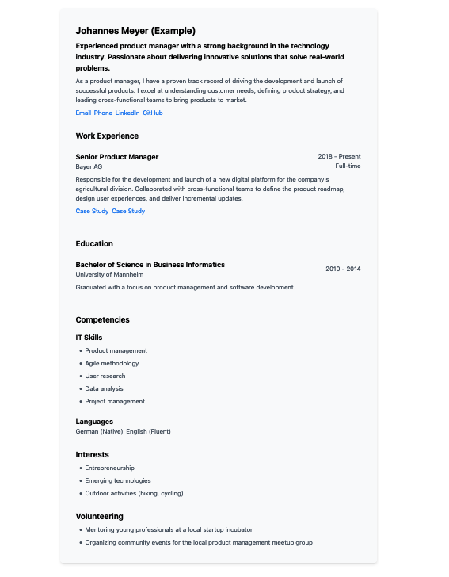

# CV from JSON

Create a 1-column CV from JSON.  
Uses AlpineJS for reading JSON.  
Uses Tailwind CSS for styling.

**Usage**

- Generate JSON CV from sample: `cp cv-sample.json cv.json`
- Adjust JSON CV
- Validate JSON against schema: `npm install -g ajv-cli` and `ajv validate -s schema.json -d cv.json`
- Open `index.html` on any server (file-only fails due to CORS)

**Screenshot**

Note: The CV is gray instead of white only for the screenshot.
